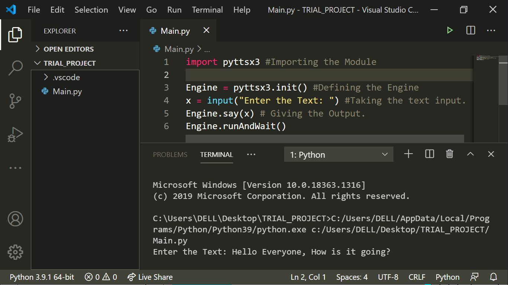

# Type_to_Speak
This Program makes your Device speak what you typed. But firstly you will need to install a modeule named 'pyttsx3'. It is a offline Text-to-Speech conversion module. Just open your Terminal/CMD/Powershell and type in:
```
pip install pyttsx3
```
And now it should have installed into your system. If not then you may refer to Unofficial Python Binaries. Now, just run the Main.py file and just type in what you want to hear. Below is my Code Screenshot:

Hope that you liked it.
